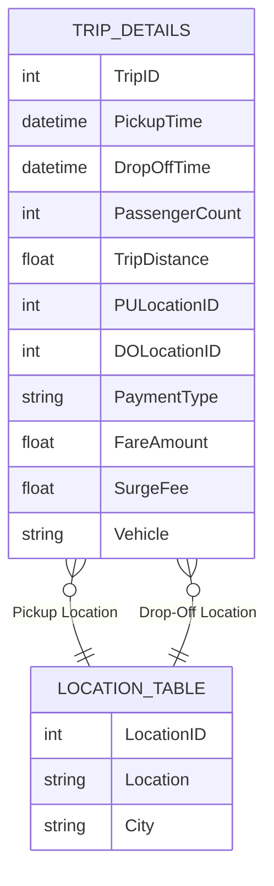

# 🚖 Uber Trip Data Analysis

This project analyzes Uber trip data to uncover insights about ride trends, peak hours, passenger patterns, location demand, and revenue metrics.  
It uses two main tables: **Trip Details** and **Location Table**.

---

## 📂 Dataset Overview

### 1. **Trip Details Table**
Contains information about individual Uber rides, including timing, fare details, vehicle type, and locations.

| Column Name          | Description |
|----------------------|-------------|
| **Trip ID**          | Unique identifier for each trip, used to track rides. |
| **Pickup Time**      | Exact date & time when the passenger was picked up. Useful for peak-hour and trip duration analysis. |
| **Drop Off Time**    | Exact date & time when the passenger was dropped off. Used for calculating trip duration and analyzing completion trends. |
| **Passenger Count**  | Number of passengers in the trip, useful for ride-sharing and demand analysis. |
| **Trip Distance**    | Distance covered during the trip (miles), used for fare calculation and trip categorization. |
| **PULocationID**     | Numeric ID for pickup location (links to `Location Table`). |
| **DOLocationID**     | Numeric ID for drop-off location (links to `Location Table`). |
| **Payment Type**     | Mode of payment (e.g., Credit Card, Cash, Wallet), for financial and preference analysis. |
| **Fare Amount**      | Base fare before any additional charges. |
| **Surge Fee**        | Extra charge during high demand, useful for surge pricing analysis. |
| **Vehicle**          | Type of Uber service used (e.g., UberX, UberXL, Uber Black). |

---

### 2. **Location Table**
Maps numeric location IDs to actual area names and cities.

| Column Name    | Description |
|----------------|-------------|
| **LocationID** | Unique identifier for each location (primary key). |
| **Location**   | Name of the area/neighborhood where pickups or drop-offs occur. |
| **City**       | City where the location is situated. |

---

## 🔍 Key Use Cases

- **Peak Hour Analysis** → Identify busiest times for pickups and drop-offs.
- **Location Demand** → Determine high-demand pickup/drop-off zones.
- **Fare & Revenue Insights** → Study fare distribution, surge pricing patterns, and payment preferences.
- **Vehicle Preference Analysis** → Understand customer choice between UberX, UberXL, Uber Black, etc.
- **Trip Distance Categorization** → Identify short trips vs. long trips.
- **Passenger Trends** → Study average passenger count per trip.

---

## 📊 Example Analyses

1. **Top 10 Most Frequent Pickup Locations**
2. **Revenue by Hour of the Day**
3. **Surge Pricing Trend Analysis**
4. **Trip Duration Distribution**
5. **City-Wise Demand Comparison**

---

## 📎 Relationships

The `PULocationID` and `DOLocationID` in **Trip Details** link to the `LocationID` in **Location Table** to get actual area and city names.

## 📊 Output

* **Overview Analysis**  
.png)

* **Time Analysis**  
.png)

* **Details**  
.png)

